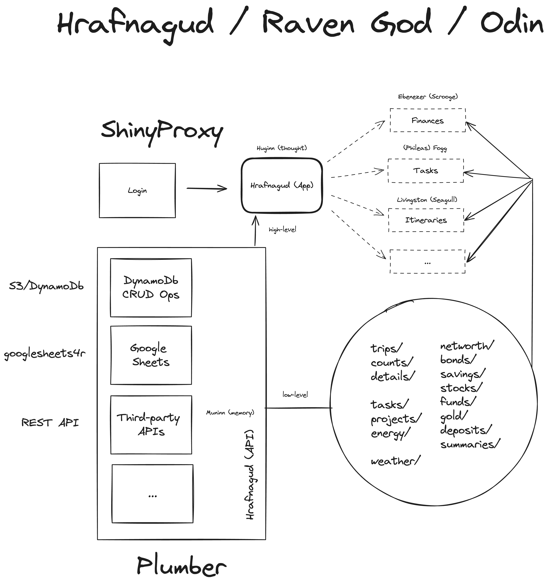

# Hrafnagud / Raven God

The goal for this API is to be a be-all, end-all of personal data analysis and collection. 

This needs AWS DynamoDb to work and thus, needs environment variables. However, the codebase is free for anyone to steal. Yes, I mean that! 🦝

I especially want you to take the DynamoDb CRUD API and see what you can build from it.

## System-level Diagram

## Full Story

Over a year ago, I saw a problem. I wanted to track my financial growth, how everything was performing, what was my total networth across instruments, but all apps I saw were bloated at best and would surely sell my information at worst. So, I set out to understand financial calculations and metrics, became an expert in it overnight (haha!) and built myself an app called Ebenezer (named for Ebenezer Scrooge).

A few days later, I wanted to plan a trip so I went to Google Trips and realised they had removed Trip Summaries. All my data was lost, and which was worse, I had no way to plan a trip. I tried to seek existing apps but again, everything was too much. All I wanted was to have a way to add my itinerary and view it later. So, I built myself an app called Livingston (named after Jonathan Livingston Seagull). 

A pattern was starting to emerge: bespoke apps named after literary characters which were now the mainstays of my browser window.

I saw a vision: what if there was an app that showed me all the information from my life at a glance? My networth from Ebenezer. My upcoming trips from Livingston. And possible many other apps I would build for myself down the line. Then, if I wanted to dive further into a part of my life, I could hit a button and go to the app for more details.

And since it was a "vision", I dubbed my project Hrafnagud or Raven God, after the Norse God Odin who sees everything, at all times.

A year of experimentation later, the project is a reality, and it is a culmination of everything I have ever learned in the world of R: AWS DynamoDb, AWS S3, AWS EC2, Plumber, ShinyProxy, tidyverse, Rhino and so much more.

In this talk, I will walk you through the journey of how this extremely ambitious, infinitely extensible project came to fruition. I will share my learnings for all the technologies I used, for all the challenges I faced, and not just that, I will show you little hacks like making your own Google Finance API using Google Sheets and a little bit of R + Plumber magic.

What do I want to leave you with? I want to leave you inspired, and I want to leave you empowered to build applications and APIs not just for work, but for yourself, so the next time you come across an app or service that just doesn't feel right, you do not settle.

And of course, I will not leave you empty handed. The open-source version of my code will be available along with the talk as well.
